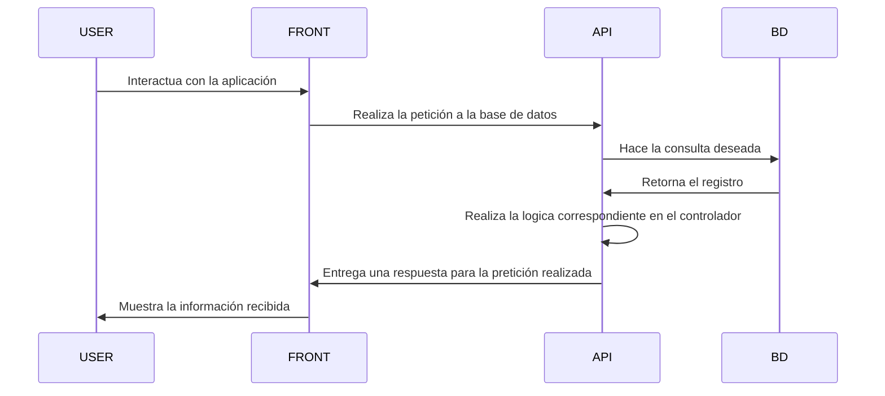

# Ocean-AR

## Links de despliegue
| Software | Función | Link | Repositorio |
| ------------- | ------------- | ------------- | ------------- |
| OceanAR-Frontend | Está es la aplicación con la que interactuaran los usuarios | NA |  |
| Ocean-AR-Backend | Es la API en la cual se realizarán las peticiones desde la aplicación del usuario | NA |  |

## Documentación

