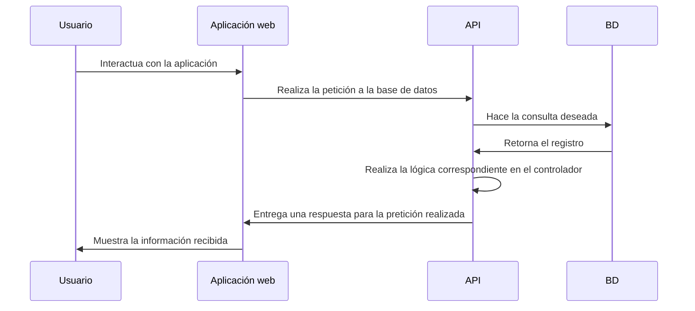

# Ocean-AR

## Problemática
Especies en peligro de extinción.

## Solución
Mostrar las especies en peligro de extinción  con el fin de concientizar a la población de una forma interactiva y divertida.

## Nota
Para acceder a todas las funcionalidades correctamente se recomienda su apertura en dispositivo móvil.

## Links de despliegue
| Software | Función | Link | Repositorio |
| ------------- | ------------- | ------------- | ------------- |
| OceanAR-Frontend | Está es la aplicación con la que interactuaran los usuarios | [Link](https://moiseshernandez26.github.io/OceanAR-Frontend/) | [Frontend](https://github.com/moiseshernandez26/OceanAR-Frontend) |
| Ocean-AR-Backend | Es la API en la cual se realizarán las peticiones desde la aplicación del usuario | Reservado por seguridad | [Backend](https://github.com/armap99/Ocean-AR-Backend) |

## Documentación

## Demo

